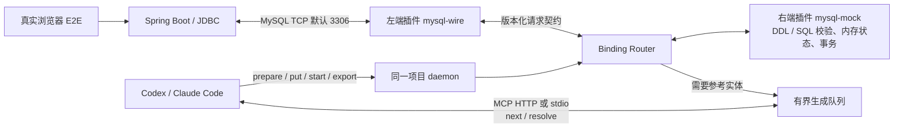

# X-Mock-MCP

让 Coding Agent 在没有企业内网数据库的开发环境中，驱动真实应用完成 E2E 测试。QA 提供自然语言用例，Agent 分析源码和 DDL，右端策略校验场景；应用仍通过真实驱动和数据库协议读写 mock 状态。

**左端 = 对接应用；右端 = 对接外部依赖。** 两端都是独立安装、启用、停用、卸载的进程插件。P0 提供 MySQL 插件对与 Spring Boot 购物样例，Kafka、ClickHouse 留给后续插件。



MCP 是 Coding Agent 的控制入口。Spring Boot JDBC 只连接我们左端的 MySQL 协议端口；右端把 QA/源码/DDL 推导出的场景落实为请求结果与状态，左端编码 MySQL 报文。核心只依赖策略接口。**不安装、不启动真实 MySQL、容器数据库或替代 SQL 引擎，不转发真实数据库兜底，不配置额外模型 API。** 参考数据通过已连接 Coding Agent 主动取件、回填完成；业务写入仍由应用产生。

## 构建与运行

需要 Go 1.27.1、Python 3、Bash，以及构建右端离线 Java AST 解析器所需的 C 编译器（CGO）。安装编译好的插件包不需要 C 编译器。购物验收还需要 JDK 21、Maven 和 Playwright 配套 Chromium。当前实测平台为 macOS arm64；详细版本及限制见 [Plus 兼容性记录](docs/compatibility/p1-mybatis-plus.md)。

```bash
# 若 Go 不在 PATH，可通过 X_MOCK_GO 指定；也会识别项目 .tools 中的工具链
bash scripts/build.sh

# 首次联网下载 Java 依赖和 Chromium；不运行数据库
export X_MOCK_JAVA_HOME=/absolute/path/to/jdk-21
bash scripts/prepare-java.sh

# 在一个终端保持运行；--listen 127.0.0.1:0 可使用空闲控制端口
JAVA_HOME="$X_MOCK_JAVA_HOME" bin/x-mock serve \
  --root "$PWD" --config examples/x-mock.yaml
```

构建输出：`bin/x-mock`、`bin/mysql-wire`、`bin/mysql-mock`；`dist/` 中左右端各有独立 ZIP 与 SHA-256 文件。插件版本和包内容绑定，不能用相同角色/ID/版本覆盖另一个摘要。

另一个终端可直接运行固定夹具演示：

```bash
python3 scripts/demo-replay.py --root "$PWD" --job shop-http
python3 scripts/demo-replay.py --root "$PWD" --job shopping-browser

# 使用真实 MyBatis Mapper，仍只连接我们的协议端口
python3 scripts/demo-replay.py --root "$PWD" --job mybatis-http
python3 scripts/demo-replay.py --root "$PWD" --job mybatis-browser

# 使用真实 MyBatis-Plus 自动 CRUD / Wrapper，独立用例验证删除
python3 scripts/demo-replay.py --root "$PWD" --job plus-http
python3 scripts/demo-replay.py --root "$PWD" --job plus-browser
python3 scripts/demo-replay.py --root "$PWD" --job plus-delete
```

脚本通过 CLI/MCP 安装并启用插件、准备场景、启动真实 Spring Boot 测试，并销毁自己创建的环境。每轮从空购物车开始；插件保持安装，供后续 Agent 使用。此脚本演示 StrictReplay，使用仓库中可审查的固定场景。Maven 与浏览器依赖准备完毕后，回放使用本地缓存，不访问模型或真实数据库。

## 连接 Codex 和 Claude Code

两个宿主使用相同的 16 个 MCP 工具。先启动上述 daemon，再配置宿主。推荐本地 stdio 桥接：桥接读取该项目 `.x-mock/ready.json` 和本地 token，只连接现有 daemon，不另外启动 MySQL 监听器。

```bash
# 输出配置片段，不修改已有宿主配置
python3 scripts/agent-config.py codex --root "$PWD"
python3 scripts/agent-config.py claude --root "$PWD"
```

将输出分别合并到项目 `.codex/config.toml` 和 `.mcp.json`。stdio 配置形状如下，把绝对路径替换为本机路径：

```toml
[mcp_servers.xmock]
command = "/absolute/path/x-mock-mcp/bin/x-mock"
args = ["mcp", "stdio", "--root", "/absolute/path/your-project"]
startup_timeout_sec = 20
tool_timeout_sec = 210
```

```json
{
  "mcpServers": {
    "xmock": {
      "type": "stdio",
      "command": "/absolute/path/x-mock-mcp/bin/x-mock",
      "args": ["mcp", "stdio", "--root", "/absolute/path/your-project"]
    }
  }
}
```

也支持 Streamable HTTP。用 `--transport http` 生成该次 daemon 的实际 URL；在启动宿主的终端设置本地连接 token：

```bash
export X_MOCK_MCP_TOKEN="$(cat .x-mock/token)"
python3 scripts/agent-config.py codex --transport http --root "$PWD"
python3 scripts/agent-config.py claude --transport http --root "$PWD"
```

这是本地 MCP 访问凭据，不是模型 API 凭据。daemon 重启会更新它。Codex 使用 `bearer_token_env_var`，Claude Code 使用 headers 中的 `${X_MOCK_MCP_TOKEN}`。配置依据：[Codex MCP](https://learn.chatgpt.com/docs/extend/mcp?surface=cli)、[Claude Code MCP](https://code.claude.com/docs/en/mcp)。

正常交互时按宿主的项目授权设置使用工具。无人值守的 Codex 验收若设置 `approval_policy="never"`，销毁、停用、卸载等有副作用的工具需要在任务已授权的前提下显式配置相应工具的 `approval_mode="approve"`；本项目保持准确的 destructive 注解。参见 [Codex 配置参考](https://learn.chatgpt.com/docs/config-file/config-reference)。

Claude Code 已提供并验证协议接入配置；按用户要求，不需要 Claude 账号，不以其真实模型 E2E 作为本版交付条件。

## 从自然语言用例开始

QA 使用 [填写模板](docs/templates/mysql-qa-scenario.md)，无需写 SQL。MySQL 右端通过 `mock_capabilities` 提供 `qa_input`、`candidate`、`scenario`、`config` 和 [guide](plugins/right/mysql-mock/qa-guide.md)。这些要求属于插件，核心没有 MySQL 必填字段。

示例目标：打开首页展示测试键盘 → 详情显示价格 99 元、库存 10 → 加入 1 件 → 购物车数量 1、合计 99 元 → 再加 1 件后仍为同一条记录，数量 2、合计 198 元 → U2 的购物车仍为空。加入购物车不扣库存。

让已连接的 Agent 执行 [完整提示](scripts/host-acceptance-prompt.md)，或给它以下工作要求：

> 读取 mysql-mock 的 QA 契约与我的自然语言 E2E；分析实际前端、Controller、Service、Repository、DTO 和最终 DDL。保留 QA 原文及固定预期，生成源码有据的 API/SQL 映射、参数域、初始实体、事务预演和状态断言。先 prepare，再 put。创建 AgentFill 环境，启动后台测试后立即 next/resolve。成功后只导出确认的参考实体；保留空购物车，用新环境 StrictReplay 重跑。最后销毁环境并分别停用、卸载左右端。

标准调用顺序：

1. `mock_plugin_install` → `mock_plugin_enable`：左右端分别操作。
2. `mock_capabilities`：指定右端角色、ID、版本，读取 QA schema 与 guide。
3. `mock_scenario_prepare(input)`：检查资料，准备阶段不监听 MySQL。
4. `mock_scenario_prepare(input, candidate)` → `mock_scenario_put`：保存插件生成的 `compiled_body`，固定 QA、源码/DDL 摘要及场景版本。
5. `mock_environment_create`：固定插件摘要与场景快照；默认 MySQL 端口 3306，可配置其他端口，0 表示临时端口。
6. `mock_run_start`：只启动 `x-mock.yaml` 中的具名任务，立即返回 `run_id`。
7. `mock_requests_next` → `mock_requests_resolve`：Agent 根据插件 schema 回填允许的不可变实体；右端验证并完成当前 JDBC 请求后才确认成功。
8. `mock_run_status` / `mock_run_trace`：核对测试退出码、SQL 规则、事务、最终状态和未完成请求。
9. `mock_scenario_export` → `mock_scenario_put`：显式选定成功生成，再创建新的 StrictReplay 环境运行同一测试。
10. `mock_environment_destroy` → `mock_plugin_disable` → `mock_plugin_uninstall`：分别处理两端。

AgentFill 当前只补固定约束下的参考实体。INSERT/UPDATE/DELETE、生成键、提交/回滚和购物车数量由应用真实请求驱动。候选中的 API 预期用于审查和测试断言，不会代替 Spring Boot 的 HTTP 处理。

## CLI、状态与插件扩展

### MyBatis 接入

右端 `mysql-mock/0.2.0` 增加 `mybatis-xml` 源码策略；左端继续使用 `mysql-wire/0.1.0` 和 `mysql.operation/v1`。QA 保留自然语言，Agent 还需读取实际 Mapper XML/Java、业务调用、参数/结果类型、DDL、配置与依赖版本。每条语句引用 XML 文件、namespace、statement ID；参数名按实际 `#{}` 出现顺序声明，右端生成 `?` 后比对完整 SQL，不能用源码摘要更新掩盖条件或参数变化。

样例通过 profile 选择 `ShopDataAccess` 实现：默认 JdbcTemplate，`mybatis` 使用真实 XML Mapper，`mybatis-plus` 使用自动 CRUD；每次选择其中一种。Controller、Service 和原购物 QA 共用。静态 XML 覆盖 constructor resultMap、生成键、事务写后读、回填及回放。动态 XML、`${}`、自定义类型处理器未支持；完整输入示例与边界见 [右端指南](plugins/right/mysql-mock/qa-guide.md) 和 [MyBatis 验收记录](docs/compatibility/p1-mybatis.md)。

右端 `mysql-mock/0.3.0` 新增独立 `mybatis-plus` 策略。Agent 提供实际实体、BaseMapper 接口、调用方法、POM、Plus 配置和 DDL；右端用 Java AST 离线核对自动 SQL。支持显式 Long/String 实体映射、selectById/selectList/selectOne、全字段 insert/updateById、有条件 delete/deleteById，以及直接 LambdaQueryWrapper 的 eq、orderByAsc/Desc。Spring Boot 真正执行 Plus 3.5.17；样例 POM 使用其 Boot3 starter，底层仍为 MyBatis 3.5.19，并保留原 XML/JdbcTemplate 流程。

购物 S1–S6 的名称、价格、数量及用户隔离预期保持不变；独立删除用例验证越权404、本人删除204、删除后空车和重复404。DELETE 在右端维护事务状态、实际影响行数与外键限制，不返回预设成功。Lombok、继承映射、逻辑删除、动态部分字段写入、条件 Wrapper 和全局自定义扩展未支持；详见 [Plus 验收与边界](docs/compatibility/p1-mybatis-plus.md)。

旧右端/场景版本保留。切换到新版本时重新 prepare/put 并固定新的插件版本；不要覆盖已安装的同版本包摘要。真实旧版 0.1.0 与新版 0.3.0 可同时安装、绑定同一个左端0.1.0，分别卸载。

每个 MCP 工具有对应 CLI，例如：

```bash
bin/x-mock capabilities --root "$PWD"
bin/x-mock plugin install --root "$PWD" --input install.json
bin/x-mock scenario prepare --root "$PWD" --input prepare.json
bin/x-mock run trace --root "$PWD" --input trace.json
```

输入 JSON 与 MCP 工具 schema 相同。安装输入示例为 `{"package_path":"/absolute/plugin.zip","sha256":"完整包摘要"}`；停用/卸载输入为 `{"role":"left","plugin_id":"mysql-wire","version":"0.1.0"}`。轨迹输入为 `{"run_id":"运行ID","after_seq":0,"limit":100}`。脚本演示会保存每次实际输入和结果，便于复用。

安装只保存包；启用允许创建实例；创建 binding 才启动进程和监听。活动实例会阻止停用、卸载，返回 `PLUGIN_IN_USE`。每个环境运行一次任务，重跑新建环境。场景保存使用 `expected_version`，工作区证据改变后必须重新准备。

插件实现 [策略接口](pluginapi/strategy.go)，提供 `--describe` 描述和 stdio JSON-RPC。左端实现 `LeftStrategy`，将应用协议归一化后 dispatch；右端实现 `RightStrategy.Execute/Complete`，可选准备、校验、导出接口。独立 manifest 声明角色、版本、契约、平台及文件摘要；核心按注册表和契约绑定，不新增数据库名称 switch。可参考 [最小进程插件](internal/testkit/plugins) 和 [MySQL 插件](plugins)。

项目状态位于 `.x-mock/`，其中 token 仅当前用户可读写。后台运行输出、轨迹和场景分开保存；64 MiB 轨迹上限或 4 MiB 任务输出上限会使运行失败。租约 15 秒；请求截止时间由环境指定，最长 300 秒。双客户端共用一个生成 owner，换主必须显式指定当前 epoch；进入 resolving 后拒绝换主。

## 验证与边界

```bash
bash scripts/verify-p0.sh
bash scripts/verify-p1.sh
bash scripts/verify-plus.sh
```

脚本先执行核心与插件 race 测试，再执行真实跨进程、JDBC/Hikari、HTTP、Chromium、AgentFill 加三次回放、业务缺陷负例及 HTTP/stdio 兼容测试，最后 vet 与独立打包。日志在 `artifacts/p0/`。不需要模型账号；真实 Codex 模型验收另有记录。

`verify-plus.sh` 包含 P0/P1 回归、真实 MyBatis 与 Plus 的离线 BoundSql、生成键检查和依赖边界。Plus 浏览器/回放轨迹在 `artifacts/p1-plus/`。依赖检查会拒绝已列明的真实或替代 SQL 引擎、容器启动库，允许 JDBC 客户端及离线 parser。升级测试从仓库历史 `68ba0aa` 构建实际旧右端，因此验收 checkout 必须包含该提交。当前执行 `verify-plus.sh` 即可，无需重复运行前两个入口。

当前支持 BIGINT/VARCHAR、受限单表 SELECT/INSERT/UPDATE/DELETE 和有限 READ COMMITTED 行为。它不等价于完整 MySQL：JOIN、DECIMAL、时间类型、运行时 DDL、其他隔离等级、TLS 及完整 InnoDB 锁行为未实现。DDL 的 ENGINE 等表选项也会拒绝。只读固定场景与有状态购物场景均有明确校验，未匹配操作不会返回伪造成功。

详见 [兼容性与验收证据](docs/compatibility/p0.md)、[实施记录](docs/implementation-progress.md) 和 [总体设计](docs/superpowers/specs/2026-09-12-x-mock-mcp-design.md)。
