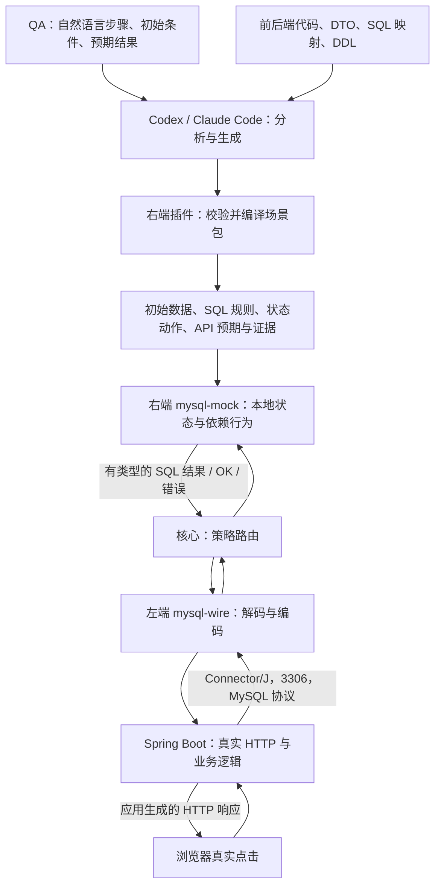

# MySQL 插件：QA 输入与自然语言 E2E 场景契约

日期：2026-09-12

状态：依据用户补充修订设计与 P0 计划；本文保留设计依据；实际实施状态与验收见 [兼容性记录](../../compatibility/p0.md)。

关联：[总体设计](2026-09-12-x-mock-mcp-design.md)、[P0 实施入口](../plans/2026-09-12-p0-implementation-plan.md)、[QA 填写模板与购物示例](../../templates/mysql-qa-scenario.md)。本契约取代原 P0 的“只读查询”范围。

**左端 = 对接应用；右端 = 对接外部依赖。** `mysql-wire` 左端和 `mysql-mock` 右端分别安装、启用、停用、卸载。MySQL 的 QA 资料要求和场景校验随右端插件发布；左端声明协议与驱动接入要求。核心只调用通用策略接口。

## 1. 从 QA 描述到应用响应

QA 可以写“进入首页能看到商品，点击商品能看到详情，加入购物车后购物车里能看到它”。Agent 结合已固定的业务预期、前后端代码和 DDL，形成可执行场景包。准备阶段完成主要数据生成，运行时只补全预先允许的数据缺口。



“API 反馈数据集合”分成彼此关联的两份产物：

| 产物 | 内容 | 消费者 |
| --- | --- | --- |
| API 预期集合 `api_expectations` | 方法、路径、业务输入、状态码、响应字段约束，以及对应 QA 步骤 | E2E 测试与报告；作为业务断言依据 |
| MySQL 依赖场景 `database_scenario` | DDL 目录、初始行、SQL 模板与参数、结果列、状态操作、事务配置 | 右端执行，左端转换为原生 MySQL 报文 |

Spring Boot 接口先执行业务代码，再通过 JDBC 发 SQL。3306 收到的是 SQL 操作，通常没有 HTTP 路径、点击名称或测试步骤 ID；不能按“点击首页”直接在数据库端选择一段 HTTP JSON。准备阶段记录 API→代码→SQL 的对应关系，运行阶段依据数据库、连接、SQL AST、实际参数和当前状态执行。HTTP/SQL 关联可用应用追踪信息或样例测试逐步采集，时间邻近只能标为推断。

全程不启动 `mysqld`、MySQL 容器、H2 或 SQLite 替代引擎。DDL 作为离线结构输入解析，右端在内存中维护受支持的表和事务状态；固定快照与操作轨迹可保存为文件。重跑创建干净实例，不延续上次购物车。

## 2. QA 必须提供什么

插件必须提供面向 QA 的表单/Markdown 模板和机器可读 schema。QA 可以用自然语言填写，由 Agent 转为结构化输入；不能要求 QA 手写 SQL 或 MySQL 报文。

| 字段 | 要求 | 购物场景示例 |
| --- | --- | --- |
| 用例名称与目标 | 必填 | 浏览商品并加入购物车 |
| 起始页面与角色 | 必填；无登录时明确游客 | 从首页开始，使用普通用户 U1 的测试登录态 |
| 初始业务条件 | 必填；可以描述条件而不枚举所有行 | 有一件上架商品 P1，库存充足，U1 购物车为空 |
| 有顺序的操作步骤 | 必填，说明目标和输入 | 点击 P1，数量填 1，点击加入购物车，再打开购物车 |
| 每步可观察预期 | 必填；“操作成功”不足以确定数据 | 首页显示名称和价格；详情与首页一致；购物车数量 1、金额为单价 |
| 数据约束及生成自由度 | 必填 | 商品名可生成；价格固定 99 元；默认数量 1；币种 CNY |
| 重复操作与写入规则 | 涉及写入时必填 | 再加入同一商品时累计到 2，不新增第二条商品行 |
| 身份/租户/权限条件 | 涉及隔离时必填；否则明确不涉及 | U2 看不到 U1 的购物车；登录态由样例应用测试 profile 提供 |
| 异常分支与范围 | 必须声明覆盖或不覆盖 | 本用例覆盖正常加入；下架、库存不足、登录失败分别另立用例 |
| 重置方式 | 有默认值，QA 可覆盖 | 每个独立用例新环境；同一用例各步骤共享状态 |

QA 负责“应该发生什么”。项目接入方提供仓库位置、代码版本、DDL/迁移文件位置、测试启动方式与配置；Agent 负责查找控制器、服务、Repository/Mapper、DTO、前端调用和事务边界。QA 不需要替开发者提供这些实现细节。

DDL 必须能确定最终表结构。若只有历史迁移且包含无法离线还原的过程，接入方补充最终 schema；不能连接真实 MySQL 获取它。没有真实数据样本也可生成数据；已有脱敏样本作为可选约束。

缺失资料按 `missing_inputs[]` 返回，包含字段路径、原因、影响步骤和建议补充方式。业务歧义按 `ambiguities[]` 返回，例如“加入购物车是否扣库存”。Agent 可以给出建议，但未确认的业务规则不能进入可运行场景；同一份准备结果可同时反馈多处缺口。仅有未用到的代码无需阻止已明确的路径。

## 3. 插件随包发布的能力

`mysql-mock` manifest 声明 `scenario.prepare`、`scenario.export`、`scenario.verify`。准备能力同时声明 QA/项目输入 schema、候选场景 schema 与分析指南。它们随插件版本升级，不写入核心的 MySQL 分支。其他右端可用相同机制定义 Kafka topic 或 ClickHouse 表所需资料。

左端继续通过 ConfigSchema 和契约能力声明监听地址、端口、认证方式与支持的驱动协议。安装 MySQL 右端并不自动安装左端，也不占用 3306。

统一调用流程：

1. `mock_capabilities` 指定插件 ID、角色、版本及 schema 名，取得输入要求与指南。
2. `mock_scenario_prepare` 提交结构化 QA 输入和项目资料引用，不带 candidate：右端核查资料，返回缺口、支持范围与生成指导。
3. Codex 或 Claude Code 读取相关代码与 DDL，生成候选场景包，再调用同一工具，附带 candidate。
4. 右端执行确定性校验和编译。返回 `ready`、`missing_inputs`、`ambiguities`、`unsupported`、`diagnostics`；仅 ready=true 时包含规范化 `compiled_body` 和摘要。
5. Agent 调用 `mock_scenario_put` 保存固定版本，建立左右端 binding，然后后台运行 E2E。Put 和右端 Start 均重新校验，不能通过跳过 prepare 存入不可运行的场景。

`mock_scenario_prepare` 不调用宿主模型、不创建应用环境、不发布场景。核心短暂启动已启用右端的准备进程，注入项目根目录，持有插件引用；任务结束关闭进程并释放引用。准备进程不调用监听服务的 Start。源文件按明确的相对路径读取，记录内容摘要；找不到文件或版本漂移时给出结构化失败。

通用扩展接口为 `ScenarioPreparer.Prepare(context, PreparationSpec) -> PreparationReport`，具体类型见 P0A。核心不解释其中的 SQL、业务步骤或数据库表。两个宿主使用相同 schema、指南与产物格式，无需数据库专属宿主 API。

## 4. 编译产物及校验责任

| 场景包字段 | 必须固定的内容 |
| --- | --- |
| `qa_contract` | 原始自然语言、规范化步骤、明确的数据约束、覆盖范围及摘要 |
| `evidence` | 使用的源文件路径、符号/行号、内容摘要、代码版本；DDL 文件与最终 schema 摘要 |
| `step_bindings` | 每步对应的页面操作、API、业务代码、SQL 规则；标记代码证据或待验证推断 |
| `api_expectations` | 从 QA 预期生成的 HTTP/UI 断言；不从当前运行结果反向改写预期 |
| `database_scenario` | schema 目录、初始行、具名 SQL 规则、精确参数域、只读缺口、连接与事务配置 |
| `verification` | 最终业务状态约束、必需写操作及调用范围、步骤间先后约束 |
| `replay` | 时钟、种子、初始状态、自增种子、插件/契约摘要、场景版本 |

LLM 负责提出数据、API/SQL 对应关系和参数域；右端从真实 SQL AST 与 DDL **自行推导执行计划**。不能接受模型随意附加“这个 SQL 等于向购物车插一行”的动作。把 `WHERE user_id = ?` 改成 `WHERE product_id = ?`、漏掉租户条件、或把 `quantity + ?` 改为常量，必须改变匹配及执行语义，并触发相应负例。

准备期至少校验：

- QA 必填项、步骤引用及歧义完整；源码/DDL 引用存在，摘要一致。
- API、SQL 和 DTO 的证据可追溯；动态 SQL 按用例实际分支解析，无法确定的结构报告缺口。
- 参数数量、类型、列顺序、nullable、主键、自增、唯一约束、外键及 VARCHAR 长度符合受支持 DDL。
- 元数据在 prepare 前已知；DML 返回零个结果列及确定的参数元数据。
- 初始行满足 DDL 和 QA 约束，列表、详情、购物车引用同一商品实体。
- 精确 SQL 能编译为受支持计划，有限参数域内执行预演满足预期状态；预演使用一次性内存状态，不作为真实浏览器验收证据。
- QA 预期与当前业务实现矛盾时保留原预期并报告冲突；不得为了通过测试而修改预期或悄悄替应用补业务动作。

编译并不能证明 Agent 对代码的理解一定正确。最终以真实应用调用、浏览器断言、SQL 轨迹和状态断言共同验证；尚未验证的映射要保留标记。

## 5. “首页 → 详情 → 加购物车”完整示例

以下表、接口和值是**设计样例**，仓库当前没有真实商城业务代码。接入真实工程时从该工程推导，不能假定它使用这些表名或 API。样例使用 BIGINT 金额分值；真实 DDL 若为 DECIMAL，插件必须实现该类型或报告不支持，不能改变业务工程的 DDL 来适配演示。

```sql
CREATE TABLE products (
  id BIGINT NOT NULL PRIMARY KEY,
  name VARCHAR(128) NOT NULL,
  price_cents BIGINT NOT NULL,
  stock BIGINT NOT NULL,
  status VARCHAR(16) NOT NULL
);
CREATE TABLE cart_items (
  id BIGINT NOT NULL AUTO_INCREMENT PRIMARY KEY,
  user_id BIGINT NOT NULL,
  product_id BIGINT NOT NULL,
  quantity BIGINT NOT NULL,
  UNIQUE KEY uq_cart_user_product (user_id, product_id),
  FOREIGN KEY (product_id) REFERENCES products(id)
);
```

初始状态：P1=`1001`，名称“测试键盘”，price_cents=`9900`，stock=`10`，status=`ON_SALE`；U1=`2001`，U2=`2002`；购物车为空，cart_items 自增起点 `5001`。U1/U2 是应用测试身份，本样例没有 users 表。所有 BIGINT 在插件 JSON 中用十进制字符串表示。

| QA 操作 | 真实应用路径（样例） | MySQL 依赖行为 | E2E 可观察预期 |
| --- | --- | --- | --- |
| 点击首页 | GET `/api/products` → 商品查询 | 按 status、排序投影 products 状态 | 显示测试键盘，99 元 |
| 点击商品 | GET `/api/products/1001` → 详情查询 | 用实际 id 查询同一 products 状态 | 名称与价格与列表一致，库存 10 |
| 加入 1 件 | POST `/api/cart/items` → CartService | 应用查商品、查购物车，再 INSERT；提交后增加一行 | HTTP 201，cartItemId=5001、quantity=1 |
| 打开购物车 | GET `/api/cart` → 购物车和商品查询 | 读取 U1 的已提交 cart_items，关联商品由样例业务代码完成 | 一行商品，数量 1，合计 99 元 |
| 再加入 1 件 | 同一 POST → 查已存在行 → UPDATE | 应用执行 quantity = quantity + ?；同一行变为 2 | HTTP 200，同一 cartItemId，数量 2、合计 198 元 |
| 用 U2 查看购物车 | GET `/api/cart`，U2 测试登录态 | WHERE user_id 使用真实 U2 参数 | 空购物车，不串到 U1 |

此样例约定加购物车不扣库存，由 QA 在模板中明确。若项目业务要求扣减或锁定库存，必须有对应代码、SQL、状态动作和断言；mock 不能在看到 INSERT 后自行扣库存。

两个关键 SQL 模板如下。规则只接受声明的用户、商品和数量域；第一条在无行时返回带列元数据的空结果，不能事先伪造购物车记录。

```sql
SELECT id, user_id, product_id, quantity
FROM cart_items WHERE user_id = ? AND product_id = ?;

INSERT INTO cart_items (user_id, product_id, quantity) VALUES (?, ?, ?);
```

插入成功的右端结果形状（本例使用自动提交；Spring 事务内则 status 应反映事务状态）：

```json
{
  "kind": "ok",
  "affected_rows": "1",
  "last_insert_id": "5001",
  "status": {"autocommit": true, "in_transaction": false},
  "warnings": 0
}
```

左端把字段编码为 MySQL OK packet；`affected_rows`、`last_insert_id` 和连接状态都有协议定义。[MySQL OK packet](https://dev.mysql.com/doc/dev/mysql-server/latest/page_protocol_basic_ok_packet.html)。后续 SELECT 从更新后的状态产生行集，Spring Boot 据此映射 DTO 和 HTTP JSON。API 预期集合只参与断言，不会被送入 JDBC socket。

## 6. 有状态执行与最小事务

每个环境/右端实例有自己的初始状态副本；同一环境连接共享已提交状态，事务工作集按 connection_id 隔离。一个环境同时只运行一个 E2E 用例，步骤共享该环境。主键、自增、唯一约束和已声明外键由确定性代码处理，影响行数由实际状态变化计算。

P0 对已登记模板支持 SELECT、单行 INSERT、受限制 UPDATE，购物车累计数量必须通过真实 UPDATE 生效。P0 不需要运行时 DELETE 来重置；重置创建新环境。DDL 仅在准备阶段离线解析，不接受应用运行时 CREATE/ALTER。

事务范围固定为可观察的 READ COMMITTED 行为：每条读取见到最新已提交状态及自身未提交写入；提交原子生效，回滚/断连丢弃工作集。支持 JDBC setAutoCommit(false/true)、BEGIN/START TRANSACTION、COMMIT、ROLLBACK 以及相应状态标志；切回 autocommit=true 处理待提交写入。显式事务中再 BEGIN、保存点、锁定读、其他隔离等级及 XA 均明确报告未支持。

这是受限 mock 状态模型，不复制 InnoDB 锁管理。并发提交修改同一行或同一唯一键时校验版本，冲突使事务失败并丢弃工作集；不能丢失更新。自动提交语句在实例锁内校验、修改并产生结果。自增分配允许回滚后留下空洞，但不同事务不能重复分配 ID；新环境恢复固定种子。

提交、回滚和 autocommit 的外部语义以 MySQL 文档为依据；没有实际状态变化时不能只返回 OK。[MySQL 事务语句](https://dev.mysql.com/doc/refman/8.4/en/commit.html)

## 7. 运行时补全与固定回放

已准备完整的购物场景可直接回放，主页点击不需要等待模型。保留 AgentFill 供探索使用，但 P0 只允许补全**显式声明为不可变的参考表**中尚未物化的行，例如商品数据。缺口具有主键、DDL schema、QA 约束和种子；类型与查询结构必须已知。

补全的是共享商品实体，而非为列表、详情分别编造互相矛盾的结果集。右端 Complete 对状态版本和业务约束校验后原子物化初始实体，再执行原查询。只能填补预声明缺口，不能覆盖已有实体或修改购物车；如果同一实体的并发补全已成功，后续相同候选幂等复用，冲突候选失败。待补全实体不能同时作为应用 DML 的修改目标。

购物车数据只能由应用的已登记 SQL 修改。写操作、事务、握手和系统查询不向 LLM 索要“是否成功”。未知 SQL 或不支持的类型生成 `unsupported`，需要扩展插件/修订候选后新建环境；不能临时给错误查询配上成功结果。

导出只将本次明确选中的、验证成功的参考实体补全合入**初始状态**，保留 SQL/参数约束、QA 断言和动作规则。不得把运行结束时 quantity=2 的购物车当成下次初始状态，也不得把写后读结果固化成脱离写入的静态行。导出后重新 prepare/put 校验，以干净购物车再回放同一点击序列。

## 8. P0 验收

1. QA 只提供自然语言业务内容，Agent 能从样例代码和 DDL 给出完整映射；缺字段、含糊业务规则和不存在的列均在准备阶段报告。
2. 分别安装并启用左右端，配置 Spring Boot 原 Connector/J 连接 mock；过程没有启动真实数据库或替代 SQL 引擎。
3. 浏览器实际完成首页、详情、加入、查看、再次加入和另一用户查看；同时验证真实 HTTP 与 JDBC 路径。HTTP 测试只算接口层验收，不能代替点击验收。
4. 去掉 INSERT、把数量加 1 改成加 2、漏掉 user_id 条件、让应用事务回滚，分别触发相关状态/UI 断言失败；mock 不替应用修复这些缺陷。
5. JDBC 验证文本与服务端预处理、元数据、生成主键、影响行数、提交可见、回滚不可见、连接池复用与并发冲突。
6. Codex 和 Claude Code 都使用同一份 QA 用例及输入契约，完成生成、prepare、后台测试、一次允许的参考数据补全、导出和固定回放。
7. 无在线模型的固定回放重复通过；不同环境和不同用户的购物车隔离；左右端仍可分别销毁、停用和卸载。

尚未实现和实测的类型、SQL、框架和事务能力不列入兼容保证。P0 的 BIGINT/VARCHAR 与有限 SQL 子集用于证明上述完整链路；任意企业工程的兼容覆盖需要继续扩展右端语义与左端编码。
