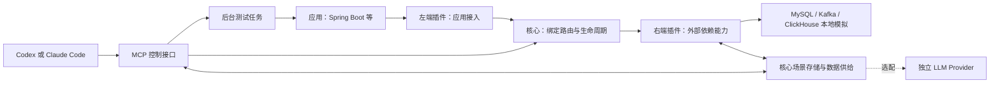

# X-Mock-MCP 设计

日期：2026-09-12

状态：用户于 2026-09-12 确认设计，进入 P0 实施计划编写阶段。

范围：双端插件架构，以及首个 MySQL 验证闭环；ClickHouse、Kafka 分别作为后续子项目。

**固定术语：左端 = 对接应用；右端 = 对接外部依赖。两端都可以独立安装、启用、停用和卸载。MCP 与 LLM 是控制和数据生成通道，不改变左右端的定义。**

## 1. 目标与基本约束

让依赖企业内网资源的 Spring Boot 等应用，在本机或开发沙箱中使用原有客户端驱动连接替代服务。Coding Agent 根据测试场景提供业务数据，替代服务负责正确的网络协议和可观察的执行状态。

用户已明确的要求：

- 支持 MySQL、Kafka、ClickHouse 等外部依赖，使用它们各自的网络协议。
- 在应用发起请求后，允许 LLM 根据测试场景生成响应数据。
- 同时兼容 Codex 和 Claude Code。
- 主要用途是解除应用流程测试对企业隔离网络的依赖。
- 左端负责对接应用，右端负责对接外部依赖，两端插件均可独立安装和卸载。
- 使用策略模式与明确的插件接口组织实现，新增协议或依赖实现不修改核心分支逻辑。

本设计采用以下实施边界：

- 可以修改测试环境中的连接地址、端口、测试凭据和驱动配置；业务代码无需为了接入 mock 而改写。
- 首版使用本地 Codex / Claude Code；远程 Agent 必须另有能访问运行环境的 MCP 通道，不能把远程机器的 localhost 当成本机。
- 以 Agent 通过 MCP 提供数据为基础，不要求额外模型 API 凭据。独立 LLM API 是可选扩展，目前没有授权或配置任何模型调用。
- 默认替代服务独立运行，不要求本机运行真实数据库或消息集群。
- 首个验证闭环限定为 MySQL 读取场景。写入、事务、消息流分别扩展，不以首个演示声称三个服务已经兼容。

## 2. 架构判断与方案比较

建议采用“左端接入插件 + 核心调度与场景服务 + 右端依赖插件”，MCP 提供统一管理入口。LLM 产出有类型的数据和场景规则，左端协议实现产出网络报文，右端实现依赖行为。

| 路径 | 做法 | 优点 | 代价与适用范围 |
| --- | --- | --- | --- |
| A：双端插件，支持运行时补全（推荐） | 左端接入应用，右端实现依赖行为；已知请求执行场景规则，未知业务请求交给 Agent；完成后保存固定场景 | 两端可以独立扩展，保留运行时生成能力，可以逐步获得可重复的测试 | 需要维护插件契约，开发协议和状态处理仍有成本 |
| B：每个业务请求都实时调用模型 | 每次查询都等待独立模型调用或 Agent 回填 | 适合探索，最接近逐请求生成的原始设想 | 每次推理增加延迟；相同请求不保证相同输出；驱动超时与状态一致性更难处理 |
| C：本地真实依赖 + Agent 生成初始数据 | MCP 管理本地实例，Agent 建表、造数、注入消息 | 数据库语义与驱动兼容性更可靠 | 要有本地运行资源和镜像/安装包；无法自然实现每个请求按用例定制响应 |

选择 A 的原因是同时服务两个阶段：探索时通过 LLM 补齐场景，回归时由固定场景执行。需要验证复杂 SQL 或数据库行为的用例，可使用 C；整个产品不把模型推理当作数据库实现。

## 3. MCP 的角色与兼容基础

Spring Boot 与左端插件之间使用应用原有驱动支持的协议。右端插件负责提供外部依赖能力，在本项目的 mock 模式下实现依赖的本地替身。MCP 用于 Coding Agent 与 X-Mock-MCP 之间的插件管理、场景管理和协作。

Codex 和 Claude Code 的官方文档均列出了 stdio 与 HTTP MCP 接入方式，因此以普通 MCP tools 为共同接口。两个宿主共享工具名称、输入 schema、输出 schema 和场景文件，安装配置分别提供。[Codex MCP 文档](https://learn.chatgpt.com/docs/extend/mcp?surface=cli)、[Claude Code MCP 文档](https://code.claude.com/docs/en/mcp)

不把 MCP Sampling 作为必需能力。2026-07-28 版规范已弃用 Sampling，建议新实现不要采用；同版规范中的采样也依附于客户端请求处理。接入一个 MCP server 不等于获得了随时调用宿主模型的接口。[MCP Sampling 规范](https://modelcontextprotocol.io/specification/2026-07-28/client/sampling)

本方案的推论：要保留 Codex 与 Claude Code 的兼容性，就让 Agent 主动调用工具获取待处理请求并提交结果。宿主专属推送能力可以以后增加，但基础流程不依赖它们。

MCP 协议适配交给官方 SDK，覆盖实施时实际验收的宿主版本与协议版本；不能只实现最新协议便声称兼容所有现有宿主。运行记录保留宿主版本、协议版本和服务版本，应用状态用显式 `environment_id`、`run_id` 标识，不依赖 MCP 连接会话的寿命。

## 4. 组件与连接方式



图中箭头表示请求方向；响应按右端 → 核心 → 左端 → 应用返回。右端插件与“本地模拟”是接口与实现的关系，不要求额外启动真实数据库。未来可增加访问真实依赖的右端插件，转发和录制不纳入本轮交付。

| 组件 | 职责 | 对外边界 |
| --- | --- | --- |
| Daemon / Plugin Manager | 管理插件包、版本、启停、环境、端口租约和测试任务 | 本地管理命令与 MCP 接口 |
| 左端策略 LeftStrategy | 监听应用连接，完成握手、认证、解码与编码 | 统一请求信封，协议专属 payload |
| Binding Router | 按显式 binding 把左端实例连接到右端实例 | 左右端实例标识、契约版本 |
| 右端策略 RightStrategy | 处理依赖操作、场景语义和协议相关状态 | 执行结果或结构化的数据补全需求 |
| Scenario Store | 保存场景版本、规则文档和运行快照 | 通用版本管理；插件定义业务 schema |
| 数据供给策略 DataStrategy | 在右端缺少数据时选择严格失败、Agent 补全或独立模型补全 | 类型化补全需求和候选数据 |
| Request Queue | 保存未命中请求，处理领取、截止时间和一次性完成 | 拉取请求、回填响应 |
| MCP Interface | 为两种 Agent 暴露同一组工具 | 普通 tools/list、tools/call |
| Test Job Manager | 启动配置好的后台测试任务，收集退出码和日志 | 快速返回 run_id，随后查询状态 |
| Artifact Store | 保存场景快照、响应来源、请求轨迹和失败原因 | 按 run_id 查询，导出可回放场景 |
| LLM Provider（选配） | 在显式启用时调用独立模型服务 | 结构化数据生成，不操作协议连接 |

一个项目默认有一个 daemon。HTTP MCP 客户端直接连接它；stdio 模式使用连接同一 daemon 的轻量桥接进程。桥接进程不再次启动左右端实例，避免 Codex 和 Claude Code 分别连接时重复监听端口。

项目锁和实例身份确保重复启动能报告已有实例，端口已被其他程序使用时明确失败，不结束其他程序。Agent 断开后 daemon 仍按运行策略处理请求和超时，重新连接可以查询已有 run。

控制接口默认绑定 `127.0.0.1`，配置本地访问令牌。应用在容器中运行时，监听地址与容器可达地址单独配置；Kafka 的元数据地址也必须从应用容器可达。

### 4.1 左端与右端的具体划分

| 绑定示例 | 左端插件：对接应用 | 右端插件：对接外部依赖 |
| --- | --- | --- |
| Spring Boot 访问 MySQL | `mysql-wire`：接收 Connector/J 发出的 MySQL 协议请求并返回协议结果 | `mysql-mock`：实现已登记 SQL 场景、结果数据，后续扩展写入与事务 |
| Spring Boot 访问 Kafka | `kafka-wire`：接收 Kafka 客户端报文，处理版本与报文编解码 | `kafka-mock`：实现 topic、分区日志、offset 和消费组行为 |
| 应用访问 ClickHouse HTTP | `clickhouse-http`：接收 HTTP 查询，处理请求和响应格式 | `clickhouse-mock`：实现 ClickHouse 查询场景与依赖语义 |

左端按应用实际使用的接入协议提供能力，因此同一个 `mysql-wire` 也可以服务使用兼容驱动的其他框架。Spring Boot 的配置发现、测试 profile 和任务启动是应用集成辅助，不要求每个框架重新实现一遍 MySQL 协议。

左端管理 socket、协议能力协商与连接编解码状态；右端管理依赖的业务状态，例如事务写集合、Kafka 消息日志和消费位点。连接设置中影响依赖语义的操作通过请求契约传给右端，避免两端各自维护互相矛盾的状态。

### 4.2 策略接口与注册机制

| 接口 | 关键操作 | 核心使用方式 |
| --- | --- | --- |
| `LeftStrategy` | Describe、ValidateConfig、Start(dispatch)、Stop | 按配置中的左端插件 ID 和锁定版本创建实例，注入通用 dispatch 回调 |
| `RightStrategy` | Describe、ValidateConfig、Start、Execute、Complete、Stop | 按 binding 找到实例，提交请求；需要补全时等待候选数据，再 Complete |
| `DataStrategy` | Resolve | 创建环境时固定一种策略，处理结构化补全需求 |

`RightStrategy.Execute` 返回三类结果：Completed、NeedsData、Unsupported。NeedsData 必须带数据 schema、上下文、截止时间、状态版本和不透明 continuation token。核心得到候选数据后调用 Complete，由右端再次校验状态和数据、执行允许的状态转换并产生最终结果。候选数据不能绕过右端直接写回应用。

内置数据供给策略是 `StrictReplay`、`AgentFill`、选配的 `ProviderFill`。请求先由右端执行既有规则；缺少数据时才进入 DataStrategy。三个策略共享同一需求契约，不混入 MySQL、Kafka 的报文处理。

Plugin Manager 根据 manifest 注册插件，Registry 根据插件 ID、版本与角色查找策略。Binding Router 只操作接口，不 import 具体插件包，不使用按 mysql/kafka/clickhouse 分支的 switch，也不让 LLM 临时决定应该路由到哪个依赖。

每条 binding 显式指定左端、右端、资源、契约版本和数据策略。只有两端支持同一个契约版本才能绑定；接口一致不代表 MySQL 左端可以直接接 Kafka 右端。创建 binding 时计算能力交集，左端向应用公布的能力不得超出右端实际支持的行为。

一条 MySQL 绑定的拟议配置如下，版本号仅用于展示锁定方式：

```yaml
bindings:
  orders_db:
    contract: mysql.operation/v1
    left:
      plugin: mysql-wire
      version: "0.1.0"
      config:
        listen: "127.0.0.1:13306"
    right:
      plugin: mysql-mock
      version: "0.1.0"
      config:
        scenario: order-query
    data_strategy: AgentFill
```

同一个环境可以包含多条独立 binding，例如订单库、报表库和消息服务；监听端点与资源 ID 一一对应。两个同类 MySQL 依赖也可以绑定不同的右端实例和场景。

### 4.3 插件包与执行方式

左右端使用同一种包格式，角色由 manifest 声明。每个插件独立版本化、安装、启停和卸载；一个便捷安装包可以引用一组左右端插件，但必须保留分别管理的能力。

包包含 manifest、当前平台可执行文件、配置 schema、请求/响应契约与必要资源。manifest 至少包含 `id`、`role`、`version`、`plugin_api_version`、`entrypoint`、`platform`、`contracts` 和各 schema 的相对路径。默认端口由左端插件声明，核心没有内置数据库端口表。

建议首版采用独立插件进程。核心中的策略对象是通用 RPC 代理，真实插件通过版本化的本地 IPC 契约执行。每个环境的插件实例有独立进程与状态，先启动右端并确认就绪，再启动左端监听应用端口。安装新的插件不要求重新编译核心。

首版 IPC 使用父进程创建的 stdin/stdout 管道传输带请求 ID 的 JSON-RPC，业务 payload 按插件 schema 校验，日志写 stderr。这是内部 Plugin API，不是宿主连接用的 MCP。通道必须支持并发请求、取消和有限大小消息；等待一次 LLM 补全不得阻塞其他连接、心跳或控制操作。

采用 Go 时不选择标准库 `plugin` 的共享库加载作为本设计的安装机制：官方文档指出其平台、工具链一致性及卸载限制；独立进程更适合本项目的独立安装和生命周期要求。这是基于官方约束作出的设计选择。[Go plugin 文档](https://pkg.go.dev/plugin)

### 4.4 安装、启用、运行、停用、卸载

安装状态与实例状态分开保存：插件包可以已安装但未启用，也可以已启用但没有正在运行的绑定。首版插件目录和启用清单按项目隔离，一个项目的卸载不影响其他项目。

| 操作 | 明确行为 |
| --- | --- |
| install | 从本地版本化插件包导入，校验 manifest、平台、Plugin API 和完整性后原子落盘；不启动监听 |
| enable | 在当前项目启用指定版本，允许创建实例；不影响另一个项目 |
| 创建环境 / binding | 锁定左右端版本并校验契约，预留端口，启动右端，再启动左端；全部 ready 后才返回可用端点 |
| 停止实例 / 销毁环境 | 停止接收应用请求，处理取消，依次关闭左端和右端，释放本环境端口与状态 |
| disable | 禁止创建新实例；仍有活动 binding 时返回 PLUGIN_IN_USE 和实例列表，先显式销毁对应环境 |
| uninstall | 仅删除当前项目中已停用、没有活动实例的版本；保留场景与运行记录，不自动卸载另一端插件 |

升级采用并排安装新版本；已有环境继续使用旧版本，新环境可选择新版本。首版不做运行中热替换，也不在插件失败后偷偷换到另一个版本。导出场景和历史记录保存左右端版本与包摘要，不阻止卸载；以后重放时若缺少对应插件，要求重新安装匹配版本，不能自动使用 latest。

若右端启动成功但左端绑定端口失败，创建环境整体回滚，停止刚创建的右端并释放租约。插件崩溃或 IPC 中断会使相关 binding 和运行失败，取消等待请求并清理其另一端实例；其他 binding 继续工作，不把状态丢失后自动重启视作原测试继续成功。

首版只需支持本地包安装，适合受限网络。在线市场、远程下载、插件间自动依赖求解都不纳入 P0。

## 5. 端口、协议和支持边界

端口都是配置项；用户提到的 9902 可以作为自定义端口，Kafka 常见接入端口是 9092。[Kafka 官方快速开始](https://kafka.apache.org/42/getting-started/quickstart/)

| 左端接入协议 | 常见端口 | 左右端配合的实现重点 |
| --- | --- | --- |
| MySQL | 3306；本地冲突时可用 13306 | 左端负责线协议与连接；右端提供系统元数据、查询结果和依赖状态 |
| ClickHouse | HTTP 8123；Native TCP 9000 | HTTP 左端与 mock 右端配合，覆盖所选 Java 驱动的数据格式与语义；Native 左端另立范围 |
| Kafka | 9092 | 左端负责 API 报文与版本；右端负责元数据、日志、offset 和消费组状态 |
| MCP 管理接口 | 18765（本项目建议值） | 独立 `/mcp` endpoint，与数据库协议监听器分开 |

MySQL 的连接本身有协议握手和认证阶段，查询之后的结果也有结构化编码；监听端口并返回 JSON 不能满足驱动需求。服务端预处理还要求管理 statement id、参数和列元数据。[MySQL 连接阶段](https://dev.mysql.com/doc/dev/mysql-server/latest/page_protocol_connection_phase.html)、[COM_STMT_PREPARE](https://dev.mysql.com/doc/dev/mysql-server/8.0.46/page_protocol_com_stmt_prepare.html)

ClickHouse 的 HTTP 接口也不等于固定 JSON API。响应可以由 FORMAT 等设置选择；后续子项目必须用目标 JDBC 驱动验证实际请求、RowBinary 等格式、类型与压缩。Native 接口单独实现，不能用 HTTP 适配器冒充。[ClickHouse HTTP 接口](https://clickhouse.com/docs/interfaces/http)、[Native TCP 接口](https://clickhouse.com/docs/concepts/features/interfaces/tcp)

Kafka 是有状态消息服务。适配器只公布已实现的 API 版本，元数据和 coordinator 返回 mock 可达地址；生产和消费依赖同一份日志与 offset，不能对每次 Fetch 随机生成消息。[Kafka 协议](https://kafka.apache.org/42/design/protocol/)

## 6. 两种运行模式

### 6.1 explore：运行时协作

1. 安装并启用需要的左右端插件。Agent 阅读用户的测试场景、表结构和相关代码，提交初始场景。
2. Agent 指定左右端 binding 并创建环境，获得应用应使用的连接配置。
3. Agent 启动预先配置的后台测试任务；工具迅速返回 `run_id`，不等待测试结束。
4. 应用连接左端。握手由左端处理，探活和系统查询由两端的确定性处理路径完成。
5. 核心按 binding 路由到右端。已命中的业务请求按固定规则返回；右端提出的数据补全需求进入队列。
6. Agent 调用 `mock_requests_next`，取出请求、场景上下文、允许的结果类型和剩余时间。
7. Agent 生成结构化结果，调用 `mock_requests_resolve`。
8. 核心验证请求归属、令牌和时限，右端 Complete 验证候选数据与状态并产生结果，左端编码响应给应用。
9. 测试结束后保留全部轨迹，并把经过确认的规则导出为固定场景。

这个流程不依赖 server 主动唤醒 LLM。Agent 必须主动执行协作循环。不能让同一 Agent 在一个同步工具中一直等测试结束，同时期望它为测试中的数据库请求生成数据。

交互式生成会使当前业务请求等待模型。首次探索允许在测试配置中给出较长请求时限，但它不能保证低于任意现有驱动超时。驱动截止时间耗尽时，该请求失败；补充场景之后，从干净环境重新运行，不假装已经恢复原连接上的请求。

### 6.2 replay：固定场景回归

- 开始前固定场景版本、初始状态、测试时钟和数据种子。
- 测试期间只执行本地规则和受支持的状态转换，不需要在线模型。
- 未命中请求、调用数量不符和不支持的语义直接使运行失败。
- 阻止执行中修改已固定的场景。新增规则生成新版本，用于下次运行。

固定规则与输入才是可重复性的基础；不能把模型 temperature 设为 0 当作相同输出的保证。并发测试还要用独立环境和明确的事件条件，避免依赖偶然的线程顺序。

## 7. 类型化数据与场景匹配

内部请求信封统一包含：`environment_id`、`run_id`、`request_id`、`binding_id`、`resource_id`、`contract_id`、契约版本、连接标识、操作、场景版本和截止时间。请求 payload 由左右端共享的插件契约定义；涉及事务时在相应契约中传递事务标识和状态版本。

核心不要求所有插件都使用 SQL 或相同的结果类型。MySQL 契约可以定义 SQL 与绑定参数，Kafka 契约可以定义 API 操作和消息；共享的只是路由、生命周期、版本和错误信封。新增依赖的字段不需要修改核心的枚举或类型分支。

LLM 不生成 MySQL 包头、Kafka correlation id、长度前缀或压缩报文。它提交业务结果，例如下面是一个已登记查询的候选结果：

```json
{
  "request_id": "req_001",
  "result": {
    "kind": "rows",
    "columns": [
      {"name": "id", "type": "BIGINT", "nullable": false},
      {"name": "status", "type": "VARCHAR", "nullable": false}
    ],
    "rows": [["1001", "PAID"]]
  }
}
```

这里 BIGINT 采用十进制字符串承载，避免 JSON 消费端的整数精度损失；适配器校验范围后按 MySQL 类型编码。Decimal、时间、二进制和 NULL 也必须有明确表示。

每个插件契约定义自己支持的结果类别，例如 MySQL 的 `rows`、`affected_rows`、`error`，或 Kafka 的消息结果；核心不把它们做成封闭的跨协议枚举。实际工具回填还要求环境、运行、领取令牌及预期状态版本。右端拒绝列数和类型不符，核心拒绝过期请求和重复的冲突结果，左端执行最终编码校验。

规则匹配以资源、数据库、解析后的查询模板、参数值/类型和场景状态为依据。参数不能被无条件忽略；修改 WHERE 条件、表名或绑定值不应自动命中原先的正确结果。未知语法不能通过粗糙归一化悄悄合并到其他规则。

MySQL 首个闭环只执行已登记的读取规则。服务端预处理需要在 prepare 阶段知道参数数目和结果列类型，因此这些元数据必须预先登记；无法解析或缺少元数据时明确失败，不能等 execute 后才向模型索取列定义。

## 8. 状态、一致性和失败策略

后续写入支持使用受限制的场景动作更新状态，例如插入主键记录、更新已知字段、向主题追加消息。动作由右端插件执行，核心保存对应场景与轨迹；不接受模型任意改写状态文件或执行代码。

MySQL 事务子项目要求：连接内暂存写集合，提交后才向其他连接可见，回滚丢弃；生成主键与 affected rows 必须与状态变化一致。支持哪一种隔离语义要写入兼容清单，不能只给 COMMIT 返回 OK 就声称事务有效。

Kafka 子项目要求：已生产的消息保存到分区日志；Fetch 按 offset 读取；提交的消费位点与消息内容一致；消费组协调、心跳和重平衡由实现维护。是否支持幂等生产、事务、压缩和新的 group protocol 必须分别验证。

跨依赖场景可以定义预置事件和一致的业务实体，但应用应完成的动作仍由应用执行。例如应用应该在写订单后发 Kafka 消息，mock 不能在观察到订单写入后自动替应用发消息，使漏发缺陷被掩盖。

待处理请求采用 `pending → leased → resolved / expired / cancelled` 生命周期。客户端断开会取消其请求；领取超时可以重新领取，旧令牌立即失效。回填同一结果可以幂等确认，但不同结果不能覆盖已完成请求。

场景元数据写入采用版本检查。同一运行在任一时刻只有一个负责生成的 Agent，其他客户端可观察；显式移交会废止旧 Agent 的领取令牌。不同测试使用不同环境和监听端点，因为普通数据库报文本身不携带测试 `run_id`。

| 情况 | 对应用与 Agent 的行为 |
| --- | --- |
| explore 中可生成的业务请求未命中 | 有界等待，并通过请求队列交给 Agent |
| replay 中请求未命中 | 返回协议错误，记录 unmatched request，运行失败 |
| 驱动等待期限到达 / 连接断开 | 请求过期或取消；拒绝迟到回填；保留诊断记录 |
| LLM 结果不符合 schema | 拒绝结果；时间预算内可修正；否则失败 |
| 不支持的协议或 SQL 行为 | 明确错误；不能自动返回成功 |
| 队列达到上限 | 有界失败，记录过载原因，避免连接无限占用内存 |
| 后台测试失败或取消 | 保存退出码和日志，结束该运行的等待请求，清理所属资源 |

握手、元数据发现、心跳等协议操作不进入生成队列，由左端编解码、右端所需的确定性状态处理共同完成。已配置的健康检查有本地实现；未实现的系统查询也需报告兼容缺口，不能一律视作成功。

## 9. 拟议 MCP 工具接口

以下为设计契约，尚未实现。所有输入的根节点均为 JSON object；错误区分参数问题、状态冲突、能力缺失和应用请求失败。

| 工具 | 用途 |
| --- | --- |
| `mock_capabilities` | 返回服务版本、已安装/启用的左右端插件、支持契约和 schema 版本 |
| `mock_plugin_install` | 导入本地插件包，安装指定角色与版本 |
| `mock_plugin_enable` | 在当前项目启用插件版本 |
| `mock_plugin_disable` | 在没有活动 binding 时停用插件 |
| `mock_plugin_uninstall` | 卸载当前项目中没有活动实例的已停用版本 |
| `mock_scenario_put` | 按插件 schema 校验并保存场景，使用 expected_version 防止并发覆盖 |
| `mock_environment_create` | 根据场景与显式左右端 binding 创建环境，返回 environment_id 与实际连接端点 |
| `mock_run_start` | 启动配置中具名的测试任务，快速返回 run_id |
| `mock_requests_next` | 有界拉取待处理请求，返回领取令牌；无请求也及时返回 |
| `mock_requests_resolve` | 校验并回填业务数据，完成等待中的请求 |
| `mock_run_status` | 查询运行状态、退出码和失败摘要 |
| `mock_run_trace` | 按游标读取请求轨迹、响应来源、命中规则和耗时 |
| `mock_scenario_export` | 导出经过明确选择的生成结果和规则，形成可回放候选场景 |
| `mock_run_stop` | 停止所属测试进程并取消未完成请求 |
| `mock_environment_destroy` | 释放该环境的连接、端口和状态 |

MCP 工具集合保持稳定，安装左右端插件不会生成另一套工具；插件列表、契约和 schema 通过 `mock_capabilities` 查询。宿主不需要因为更换依赖插件而学习另一套管理流程。

测试任务通过项目配置登记命令、参数、目录、测试 profile 和时限。`mock_run_start` 选择具名任务，不要求模型把任意 shell 文本放进请求；执行时使用参数数组，日志与 MCP 输出分离。

`mock_requests_next` 的单次等待建议不超过 2 秒，批次和返回文本有大小上限；这只是建议初值，验收时测量。整个业务请求可有更长总时限，二者不能混同。大结果保存为运行产物，通过分页读取，避免每次把整个数据库或测试日志发送给模型。

## 10. Codex 与 Claude Code 的接入设计

实现后的公共入口规划为一个独立 daemon 和一个 stdio 桥接命令。以下只是接入示例，不表示当前已有可执行程序或监听服务。

共同的 HTTP 入口：`http://127.0.0.1:18765/mcp`。Codex 和 Claude Code 都连接相同实例和工具集合，凭据通过各自支持的环境变量配置传入，不提交到仓库。

Codex 的项目配置片段：

```toml
[mcp_servers.x_mock]
url = "http://127.0.0.1:18765/mcp"
bearer_token_env_var = "X_MOCK_TOKEN"
```

Claude Code 的项目配置片段：

```json
{
  "mcpServers": {
    "x_mock": {
      "type": "http",
      "url": "http://127.0.0.1:18765/mcp",
      "headers": {
        "Authorization": "Bearer ${X_MOCK_TOKEN}"
      }
    }
  }
}
```

这两段分别放入对应宿主的项目配置；实际接入时要遵循宿主的项目信任和 MCP 权限设置。stdio 桥接是另一种传输选择，复用同一业务接口。

Codex 和 Claude Code 提供相同的操作指导：安装/启用左右端插件 → 建立场景与 binding → 创建环境 → 后台运行测试 → 拉取和解决请求 → 收集结果 → 导出场景 → 用新环境回放。核心操作指导放在共享文档和工具描述中，宿主专用说明只负责各自的接入配置。

独立模型 API 若被选择，则实现为替换“获取结构化候选结果”这一步的 provider。它需要显式选择调用地址和凭据，不会自动读取或复用 Codex / Claude Code 的登录令牌，也不会在 Agent 不在线时暗中切换到云端服务。

## 11. 分阶段交付与验收

先落实双端插件契约和生命周期，再用 MySQL 的一对插件验证完整架构；每个协议单独形成可验收范围。

| 阶段 | 交付 | 验收重点 |
| --- | --- | --- |
| P0：插件框架与 MySQL 读取闭环 | daemon、插件安装卸载、左右端策略、`mysql-wire` + `mysql-mock`、两个宿主的 MCP 接入、场景与测试回放 | 独立安装/启用一对插件，用真实 Connector/J + HikariCP 的 Spring Boot 样例走通读取与断言 |
| P1：MySQL 写入和事务 | 扩展 MySQL 契约与右端状态动作、生成主键、提交回滚、错误注入 | 写后读一致，回滚不泄漏；增加 MyBatis/JPA 各自的兼容样例 |
| P2：ClickHouse HTTP 插件对 | `clickhouse-http` + `clickhouse-mock`，针对选定 Java 驱动覆盖格式、类型与压缩 | 通过安装新插件扩展核心，真实驱动能够连接并完成指定查询 |
| P3：Kafka 插件对 | `kafka-wire` + `kafka-mock`，单 broker 场景、生产消费和消费组状态 | 通过安装新插件扩展核心，用 Spring Kafka 验证收发、offset 和重启恢复 |

P0 应完成：

1. 固定一套 Spring Boot、JDK、Connector/J、HikariCP 版本，在实现计划中锁定版本；发布兼容报告只列实际通过的组合。
2. 使用 MySQL 原有驱动，覆盖连接池初始化、探活、文本读取、预登记元数据的服务端预处理读取、空结果和错误结果。
3. 支持所选本地认证方式、数据库选择、字符集和该驱动必需的连接设置；不宣布未经验证的协议能力。测试 profile 中明确 TLS 与自动 schema migration 的取值。
4. 应用使用自动提交的读取流程；写入、显式事务和未支持的 DDL 在 P0 返回能力缺失，P1 再实现。
5. Codex、Claude Code 各自实际完成一次“读取未命中 → 获取请求 → 回填 → 应用断言成功”。MCP Inspector 只能补充工具验证，不能替代两个宿主的实际联调。
6. 同一固定场景在无模型调用的条件下重复运行，得到相同业务结果；改错查询条件必须失败。
7. 验证迟到回填、重复回填、连接断开和 Agent 断开不会产生挂起请求或错配响应。
8. Codex 和 Claude Code 同时连接 daemon 不发生重复监听；两个隔离环境的状态不串扰。
9. 左右端插件都能单独安装、启用、停用和卸载；安装不会占端口，活动引用阻止卸载，启动失败能够回滚。
10. 用测试用的左右端最小插件验证通用契约：新增插件包无需修改核心；缺少契约交集会在创建 binding 时被拒绝。
11. 故意使一端插件崩溃，验证相关 binding 清理、等待请求取消和其他 binding 不受影响。

固定回放的请求延迟目标应低于选定驱动的超时，并在验收报告中记录实测分位数。当前设计没有性能测试数据，也不承诺运行时 LLM 在任意时限内完成。

建议 daemon 使用 Go，插件通过独立进程和版本化 IPC 契约接入，不要求插件与核心共享编译工具链。协议库保留在左端插件内部，依赖行为库保留在右端插件内部，MCP SDK 保留在控制接口模块；这些依赖不能反向渗透到核心路由。

P0 的实施计划先锁定 Plugin API 和 MySQL 操作契约，再验证协议库与 MCP SDK 并锁定版本。是否支持服务端预处理、目标认证和取消机制，必须通过真实驱动验证后才能定库，不能仅以存在一个 server API 为依据。

## 12. 结果的含义与下一步决策

这个产品验证的是“应用在约定外部依赖行为下能否完成测试流程”。它不能据此证明生产数据库的优化器、锁行为、Kafka 集群容错或企业网络配置正确。需要那些保证的用例仍要使用真实依赖的测试环境。

测试的业务预期应在开始前固定。探索时生成的响应标记为 generated，直到审阅并形成规则后才进入回归场景；Agent 不得因为应用执行了错误查询，就修改 mock 使原测试自动通过。

本轮采用 Agent 协作为基础，独立模型 API 保留为待用户选择的可选能力。无论选择哪项，左右端的定义、插件策略接口、场景管理和两个宿主使用的 MCP 工具都保持同一套设计。

设计已通过用户评审，先为 P0 编写实施计划；其余阶段分别细化协议范围与验收条件。本文件记录设计，不表示 mock 服务已经实现或通过验收。
